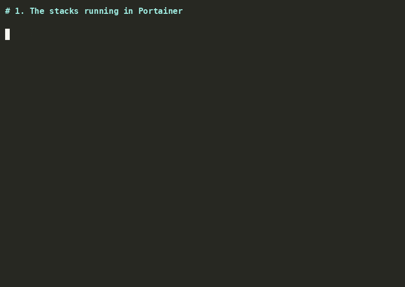

# Portrieve

[](https://github.com/nopoz/portrieve/releases)
[](LICENSE)
[](https://github.com/nopoz/portrieve/actions/workflows/ci.yml)
[](https://github.com/nopoz/portrieve/actions/workflows/publish.yml)
[](https://github.com/nopoz/portrieve/pkgs/container/portrieve)

**Back up, restore, and migrate [Portainer](https://www.portainer.io/) stacks as
plain Docker Compose files.** Portrieve exports every stack from a Portainer
instance to version-controllable files, then redeploys them, on the same server
or a different one, through the Portainer API. It is the round trip Portainer
itself does not offer: backups you can read and commit, plus a one-command restore
or migration.

- **Export** writes a synced, Docker-native backup of every stack across every
  environment: `docker-compose.yml`, `.env`, stack metadata, and per-endpoint
  network info.
- **Import** redeploys those backups (or any compose/`.env` files you supply),
  creating new stacks and recreating the external networks they depend on,
  including subnet/gateway so stacks that pin static IPs keep working.

Portrieve runs as a container or as a single Bash script. Its commands:

```bash
portrieve export       # back up every stack
portrieve import       # restore or migrate stacks
portrieve test         # check config and connectivity
portrieve endpoints    # list environments (IDs, names)
portrieve stacks       # list stacks
```



## Contents

- [Features](#features)
- [Why Portrieve](#why-portrieve)
- [Prerequisites](#prerequisites)
- [Run with Docker](#run-with-docker)
- [Run as a script](#run-as-a-script)
- [Discovery commands](#discovery-commands)
- [Export](#export)
- [Installing yq](#installing-yq)
- [Import](#import)
- [Security notes](#security-notes)
- [Troubleshooting](#troubleshooting)
- [Disclaimer](#disclaimer)
- [License](#license)

## Features

- Discovers and processes all Portainer endpoints (environments) automatically
- Exports each stack's `docker-compose.yml`, `.env`, and raw stack metadata
- Exports per-endpoint Docker network info (`networks.json`)
- Sync-style backups: prunes configs for stacks/endpoints deleted in Portainer
- Imports stacks back into Portainer (standalone Compose and Swarm)
- Migrates stacks between endpoints/hosts with `--endpoint` (id or name)
- Recreates `external: true` networks before deploying, carrying over driver,
  labels, options and IPAM (subnet/gateway)
- Safe by default: existing stacks are skipped on import unless `--update`
- `--dry-run` previews every import action without making changes
- Discovery commands (`test`, `endpoints`, `stacks`) to inspect a Portainer
  instance and find the values you need for import
- Runs as a script or as a container, with optional cron-scheduled backups
- Colorized output, run logging, and automatic retry/backoff on API requests

## Why Portrieve

Most Portainer backup utilities only cover the *backup* half, and Portainer's own
API backup is an all-or-nothing database archive. Portrieve is built around the
**round trip** and per-stack granularity:

| Capability | Typical backup tools | Native `/api/backup` | This tool |
|---|:--:|:--:|:--:|
| Per-stack `docker-compose.yml` | some | no (DB blob) | yes |
| Per-stack `.env` | rarely | no | yes |
| Docker network info | no | no | yes |
| Granular per-stack restore via API | no | no (full DB only) | yes |
| Recreate external networks (incl. IPAM) | no | n/a | yes |
| Migrate a stack to another endpoint/host | no | no | yes |
| Plain files you can commit to git | partial | no | yes |

If you only need scheduled backups, mature containerized tools already do that
well. Portrieve's niche is **getting stacks back in** selectively, on any
endpoint, with their environment variables and external networks intact, which
makes it as much a migration and disaster-recovery tool as a backup one.

## Prerequisites

You need a Portainer API access token and a reachable Portainer URL, then either:

- **Docker** (simplest): all dependencies are baked into the image, so there is
  nothing else to install. See [Run with Docker](#run-with-docker).
- **A shell**, to run the script directly. Requires Bash, `curl`, and `jq`, plus
  the optional [`yq`](https://github.com/mikefarah/yq) for `import`'s external
  network detection. Without `yq`, network recreation is skipped (with a warning)
  and everything else works. See [Installing yq](#installing-yq).

## Run with Docker

Every Portainer user already runs Docker, so the container is the easiest way to
use Portrieve: no Bash, `jq`, or `yq` to install, and it works the same on Linux,
macOS, Windows, and NAS systems. Credentials are passed as environment variables
(`PORTAINER_URL`, `PORTAINER_API_KEY`), and backups land in `/backup`.

Pull the published image:

```bash
docker pull ghcr.io/nopoz/portrieve:latest
```

Or build it locally:

```bash
docker build -t portrieve .
```

One-shot commands (any subcommand works: `export`, `import`, `test`, `endpoints`,
`stacks`):

```bash
# Check connectivity
docker run --rm \
  -e PORTAINER_URL="https://portainer.example.com:9443/api" \
  -e PORTAINER_API_KEY="ptr_xxxxx" \
  ghcr.io/nopoz/portrieve:latest test

# Export every stack to a host directory
docker run --rm \
  -e PORTAINER_URL="https://portainer.example.com:9443/api" \
  -e PORTAINER_API_KEY="ptr_xxxxx" \
  -v "$PWD/portainer_backups:/backup" \
  ghcr.io/nopoz/portrieve:latest export
```

### Scheduled backups

Set `SCHEDULE` to a cron expression and the container runs the command on that
schedule, staying up between runs. This is the recommended way to keep unattended,
version-controllable backups.

The included [`docker-compose.yml`](docker-compose.yml) is a ready-made scheduled
backup service. Put your credentials in a local `.env` file (git-ignored), then:

```bash
docker compose up -d        # daily export at 03:00 by default
docker compose logs -f      # watch runs
```

| Variable | Purpose |
|----------|---------|
| `PORTAINER_URL` | Portainer API URL (include the `/api` suffix) |
| `PORTAINER_API_KEY` | Portainer API access token |
| `SCHEDULE` | Cron expression; when set, the command runs on this schedule |
| `TZ` | Timezone the schedule is interpreted in (default UTC) |
| `RUN_ON_START` | Also run once at container start (default `true`) |
| `PORTAINER_BACKUP_DIR` | Backup directory inside the container (default `/backup`) |

## Run as a script

Prefer to run it directly on a host? Portrieve is a single Bash script
(`portrieve.sh`).

1. Clone the repository and make the script executable:
   ```bash
   git clone https://github.com/nopoz/portrieve.git
   cd portrieve
   chmod +x portrieve.sh
   ```

2. Provide credentials as environment variables:
   ```bash
   export PORTAINER_URL="http://YOUR_PORTAINER_IP:9000/api"
   export PORTAINER_API_KEY="YOUR_API_KEY"
   ```
   or in a config file (the variables above override it):
   ```bash
   cp .portainer_config.sample .portainer_config
   # then edit api_key and portainer_url
   ```
   The URL **must** include the `/api` suffix. Generate an API key in Portainer
   under **My account → Access tokens**, and keep credentials out of version
   control (`.portainer_config` is already git-ignored).

3. Run any command:
   ```bash
   # Back up every stack into ./portainer_backups
   ./portrieve.sh export

   # Preview a full restore (no changes made)
   ./portrieve.sh import --source portainer_backups --dry-run

   # Restore for real (existing stacks are skipped, not overwritten)
   ./portrieve.sh import --source portainer_backups
   ```

## Discovery commands

Read-only helpers for inspecting a Portainer instance, handy for confirming your
setup works and for finding the endpoint ID/name to pass to `import --endpoint`.
All three print a human-readable table by default, or raw JSON with `--json`.

```bash
# Verify config, connectivity and API key; report how much is visible
./portrieve.sh test

# List environments: use an ID or NAME here for import's --endpoint
./portrieve.sh endpoints

# List all stacks, or just those on one endpoint
./portrieve.sh stacks
./portrieve.sh stacks --endpoint nas        # by name
./portrieve.sh stacks --endpoint 1 --json   # by id, as JSON
```

Example:

```
$ ./portrieve.sh endpoints
ID    NAME                         TYPE          STATUS
1     nas                          Docker        up
16    htpc                         Docker-Agent  up
20    desktop                      Docker-Agent  up

$ ./portrieve.sh test
[INFO] Testing connection to http://192.168.1.2:9000/api
[SUCCESS] Connected and authenticated (HTTP 200)
[INFO] Endpoints visible: 3
[INFO] Stacks visible: 101
```

`test` exits non-zero on failure and reports the cause (e.g. authentication
failed, host unreachable), making it suitable for scripts and health checks.

## Export

```bash
./portrieve.sh export
```

| Option           | Description                                      |
|------------------|--------------------------------------------------|
| `--config FILE`  | Config file path (default `.portainer_config`)   |
| `--out DIR`      | Output directory (default `portainer_backups`)   |

The export tree is **synced** on every run: directories for stacks or endpoints
that no longer exist in Portainer are removed from the backup, so the directory
always mirrors live state.

### Output structure

```
portainer_backups/
├── export.log
└── endpoint-name-{endpoint_id}/
    ├── networks.json
    └── stack-name/
        ├── docker-compose.yml
        ├── .env
        └── stack_metadata.json
```

- `export.log`: detailed log of the most recent export run
- `networks.json`: user-defined Docker networks for the endpoint (name, driver,
  labels, IPAM), used by `import` to recreate external networks. Predefined
  `bridge`/`host`/`none` networks are excluded. Endpoints whose Docker API is
  unreachable are skipped here without failing the run.
- Per stack: the compose file, its environment variables (if any), and the raw
  stack metadata returned by Portainer

## Installing yq

> **Important:** there are two unrelated tools named `yq`. This script requires
> **[mikefarah/yq](https://github.com/mikefarah/yq) v4+** (written in Go). The
> Python `yq` (kislyuk, a `jq` wrapper) uses different syntax and is **not
> compatible**; the script detects it at runtime and warns. On Debian/Ubuntu,
> `apt install yq` typically installs the wrong (Python) one, so prefer the
> options below.

| Platform | Command |
|----------|---------|
| macOS / Linux (Homebrew) | `brew install yq` |
| Linux (Snap) | `sudo snap install yq` |
| Alpine | `apk add yq` |
| Arch | `pacman -S go-yq` |
| Windows | `choco install yq` · `winget install yq` · `scoop install yq` |

**Debian / Ubuntu** (where `apt` gives the wrong `yq`): use Snap if available,
otherwise grab the static binary (no prerequisites, works in containers/WSL):

```bash
sudo curl -sSL -o /usr/local/bin/yq \
  "https://github.com/mikefarah/yq/releases/latest/download/yq_linux_$(dpkg --print-architecture)"
sudo chmod +x /usr/local/bin/yq
yq --version   # should print: yq (https://github.com/mikefarah/yq/) version v4.x
```

## Import

Import can read this tool's own backups, a single stack directory, or an
arbitrary compose file you provide.

```bash
# Import every stack from a backup tree into their original endpoints
./portrieve.sh import --source portainer_backups

# Preview first, without making changes
./portrieve.sh import --source portainer_backups --dry-run

# Import one backed-up stack into a specific endpoint
./portrieve.sh import --stack portainer_backups/nas-1/grafana --endpoint 2

# Import an arbitrary compose file as a new stack
./portrieve.sh import --compose ./my-compose.yml --name myapp --endpoint 1

# Overwrite stacks that already exist (otherwise they are skipped)
./portrieve.sh import --source portainer_backups --update
```

| Option                | Description                                                        |
|-----------------------|--------------------------------------------------------------------|
| `--config FILE`       | Config file path (default `.portainer_config`)                     |
| `--source DIR`        | Import all stacks under a backup tree (default `portainer_backups`)|
| `--stack DIR`         | Import a single stack directory                                    |
| `--compose FILE`      | Import a single compose file (requires `--name`)                   |
| `--name NAME`         | Stack name (used with `--compose`)                                 |
| `--endpoint ID\|NAME` | Target endpoint override (else uses metadata `EndpointId`)         |
| `--update`            | Update stacks that already exist (default: skip them)              |
| `--prune`             | With `--update`, prune services removed from the compose file      |
| `--dry-run`           | Show planned actions without calling any write endpoints           |

The three source modes are mutually exclusive and take precedence in this order:
`--compose` → `--stack` → `--source`.

`--stack` and `--source` recognize any standard compose filename (`compose.yaml`,
`compose.yml`, `docker-compose.yaml`, `docker-compose.yml`); if a directory holds
more than one, Docker's precedence order picks the winner.

### Importing your own existing compose files

You do not need a portrieve backup to import. Point `--compose` at any single
file, or arrange a folder so each stack lives in its own subdirectory (the
subdirectory name becomes the stack name) and bulk-import with `--source`:

```text
mystacks/
├── grafana/compose.yaml
├── immich/docker-compose.yml
└── nginx/
    ├── compose.yaml
    └── .env
```

```bash
# Bulk-import a folder of existing stacks onto endpoint 1
./portrieve.sh import --source mystacks --endpoint 1

# Or one file at a time (any filename), naming each stack explicitly
./portrieve.sh import --compose ./grafana.yaml --name grafana --endpoint 1
```

A sibling `.env` next to a compose file is picked up automatically. Re-run with
`--update` to reconcile changes; existing stacks are skipped otherwise.

### How import resolves things

- **Endpoint:** `--endpoint` (id or name) wins; otherwise the `EndpointId` from a
  backed-up `stack_metadata.json`. The resolved id is validated against the live
  endpoint list before anything is deployed.
- **Environment variables:** a stack's `.env` is parsed back into Portainer
  environment pairs. Blank lines and `#` comments are ignored; each remaining line
  is split on its first `=`, so values may themselves contain `=`.
- **Type:** Swarm vs standalone is read from `stack_metadata.json` (`Type` 1 =
  Swarm, 2 = Compose); explicit `--compose` imports default to standalone Compose.
  For Swarm, the target cluster's `SwarmID` is detected from the endpoint on a
  best-effort basis.
- **Networks:** networks declared *inside* the compose file are created by
  Portainer automatically. Networks marked `external: true` are recreated first,
  carrying over the matching `networks.json` entry's driver, labels, options and
  IPAM (subnet/gateway) when one is found, so stacks that pin static IPs
  (`ipv4_address`) keep working. With no saved entry a plain `bridge` network is
  created. This step requires a compatible [`yq`](#installing-yq). Importing a
  stack folder in isolation (away from its endpoint's `networks.json`) falls back
  to `bridge` for external networks.
- **Conflicts:** a stack whose name already exists on the target endpoint is
  skipped with a warning, unless `--update` is given (then it is updated via PUT).
  Import is therefore safe to re-run.

### Cross-host migration caveats

When importing a stack onto a *different* host than it came from, a few compose
details are host-specific and may need attention:

- **Host-pinned ports.** A binding like `192.168.1.2:8191:8191` ties the port to one
  host's IP and will not bind on another host ("cannot assign requested address").
  Drop the IP prefix (`8191:8191`) or change it before importing.
- **Bind-mount paths.** Host paths in `volumes:` (for example `/volume2/docker/...`)
  must exist on the target, or Docker will create them empty and the service
  starts with no data. Provision the paths first when migrating stateful stacks.
- **Subnet conflicts.** A recreated external network keeps its original subnet. If
  that subnet overlaps a network already on the target host, creation fails; pick a
  free subnet or remove the fixed `IPAM` config before importing.

## Security notes

- `.portainer_config` holds your API key; keep it out of version control (it is
  git-ignored here).
- Exported `.env` files and metadata may contain secrets. The backup directory is
  git-ignored and is **not** encrypted by this tool, so protect it accordingly.
- Prefer HTTPS for `portainer_url` in production.

## Troubleshooting

1. **Cannot connect to Portainer**: verify `portainer_url` (including the `/api`
   suffix) and that the API key is valid with sufficient permissions.
2. **Missing dependencies**: install `curl` and `jq` (e.g. `apt install curl jq`).
   For full import network support, install `yq` (see [Installing yq](#installing-yq)).
3. **External networks not recreated on import**: install a compatible `yq`. If
   import warns *"Found an incompatible 'yq'"*, you have the Python `yq` instead
   of [mikefarah/yq](https://github.com/mikefarah/yq) v4+; reinstall via the
   methods in [Installing yq](#installing-yq).
4. **Permission denied**: run `chmod +x portrieve.sh` and ensure you have write
   access to the backup directory.

## Disclaimer

Provided as-is, without warranty. Import creates and updates real stacks on your
Portainer instance; always run with `--dry-run` first to review what will happen,
and verify you have backups before using `--update` against live environments.

## License

Released under the [MIT License](LICENSE).
